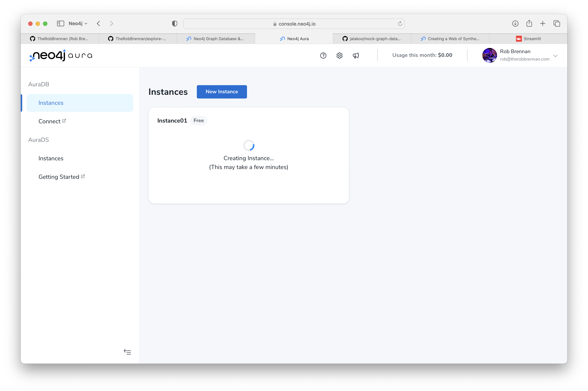
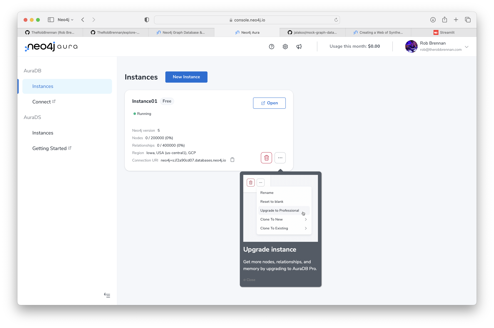

# Welcome
This project has been created as a starting point to explore working with [Neo4j](https://neo4j.com).

## Getting started
If this is your first time exploring or getting started with [Neo4j](https://neo4j.com), I recommend creating a free Neo4j database instance on [Neo4j Aura Console](http://console.neo4j.io/).

### Create a free Neo4j database on AuraDB
To create a free Neo4j database on AuraDB:

- Log in (or create a free account) to the [Neo4j Aura Console](http://console.neo4j.io/)

- Create a free AuraDB instance

- Download the Neo4j credentials as a `txt` file

- Confirm that you have copied or downloaded the credentials

- Wait for your new instance to be created

You are now ready to explore your Neo4j workspace for your AuraDB instance 🤓

### Explore your Neo4j Workspace for your AuraDB instance

- Click "Open" once your new instance is ready

- Review and agree to the Terms and Conditions

- Connect to your Neo4j AuraDB instance

- OPTIONAL: Review beginner guides

- Continue with a blank database

### Resources
- [Neo4j AuraDB overview](https://neo4j.com/docs/aura/auradb/)

- [Creating an instance](https://neo4j.com/docs/aura/auradb/getting-started/create-database/)

